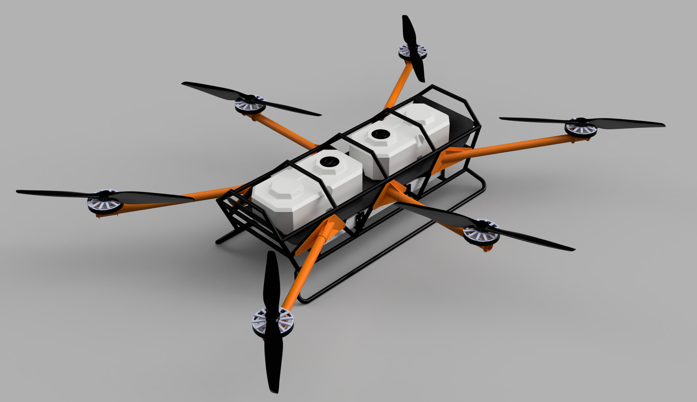

# Project Caribou 🦌



**An open-source heavy-lift hexacopter for cargo logistics and precision agriculture.**

Project Caribou is a ~200 kg MTOW hexacopter with ~100 kg payload capacity, 18–24S power architecture, and ArduPilot firmware. Designed for ruggedness, field repairability, and cost-effective manufacturing. Built on lessons from Project Feather and Project Quiver.

Developed by [Arrow Air](https://arrowair.com) and released under the CERN Open Hardware Licence.

## Key Features

- **Heavy lift** — ~100 kg payload for cargo delivery or 80L liquid spraying
- **Hybrid material airframe** — welded steel/aluminum core with detachable CF or aluminum motor arms
- **High-voltage architecture** — 18–24S (60–100V) with external HV kill switch and redundant power supply
- **Redundant avionics** — triple-redundant IMU, GPS, and compass
- **ArduPilot firmware** — standard QGroundControl/Mission Planner compatibility
- **Field serviceability** — modular arms for transport, replaceable components

## Repository Structure

```
project-caribou/
├── src/                    # CAD models, schematics, design files
├── docs/
│   ├── ADRs/               # Architecture Decision Records
│   └── meetings/           # Meeting notes and summaries
└── CONTRIBUTING.md
```

## Community

- **Discord** — [discord.gg/arrow](https://discord.gg/arrow) — `#project-caribou-general`
- **DAO Forum** — [dao.arrowair.com](https://dao.arrowair.com)

## License

[CERN Open Hardware Licence Version 2 - Strongly Reciprocal (CERN-OHL-S)](LICENSE)
