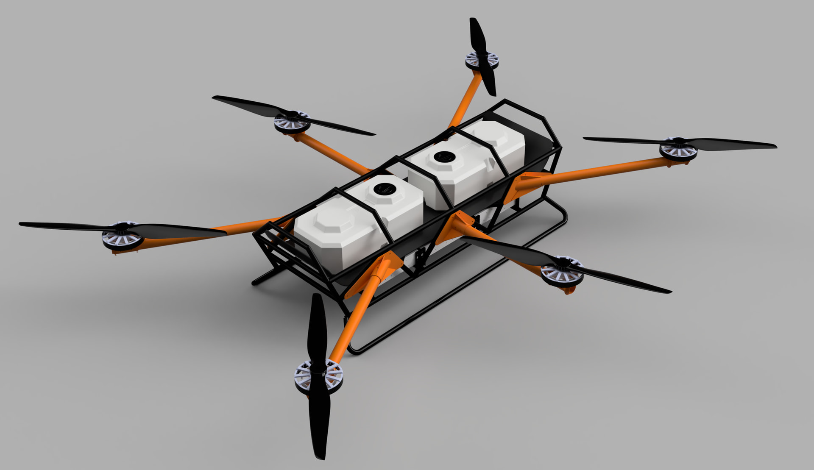

# Project Caribou



Project Caribou is an open-source heavy-lift hexacopter for cargo logistics and precision agriculture, developed by [Arrow](https://arrowair.com). With a target maximum takeoff weight of ~200 kg and ~100 kg of payload capacity, Caribou is designed to take on work currently flown by helicopters and light aircraft — large-area spraying, spreading, and heavy cargo delivery — at a fraction of the operating cost.

Caribou builds directly on lessons from Project Feather and Project Quiver: distributed custom PCBs, CAN-based smart battery telemetry, and a design philosophy centered on ruggedness, field repairability, and cost-effective manufacturing.

All design files and documentation are released under the [CERN Open Hardware Licence v2 — Strongly Reciprocal](https://ohwr.org/cern_ohl_s_v2.txt).

## Key Capabilities

- **Heavy lift** — ~100 kg payload capacity for cargo delivery or ~80 L liquid spraying missions
- **Powerful off-the-shelf propulsion** — 6× Hobbywing XRotor X15 propulsion units with 63" (1600 mm) propellers, rated at up to 72 kg maximum thrust per rotor
- **High-voltage architecture** — 18S (~75 V) power system for PT1 with Tattu smart batteries, external HV kill switch, pre-charge circuitry, and redundant power supply
- **Custom electronics** — purpose-built battery connector PCB (CBC) and main PCB (CMAIN) handling power distribution, battery telemetry, and safety switching
- **Redundant avionics** — triple-redundant IMU, GPS, and compass running ArduPilot, compatible with QGroundControl and Mission Planner
- **Hybrid airframe** — welded steel/aluminum core structure with detachable motor arms for transport and field service

## Why Caribou

Agricultural spraying and spreading jobs at this scale are flown today with helicopters and fixed-wing aircraft. A heavy-lift multirotor that can be trucked to a field, assembled by a small crew, and operated at far lower cost per flight hour opens that work to many more operators.

For Arrow, Caribou is also a milestone: it is the largest aircraft the DAO has built, and a deliberate step on the roadmap from small drones toward larger — and eventually manned — aircraft.

## Development Status

Caribou is in the **PT1 (proof of concept)** phase. The PT1 goal is to validate the structural design and high-voltage power architecture, with a stable tethered hover as the milestone.

As of mid-2026:

- The PT1 frame structure is built
- CMAIN and CBC PCBs are manufactured, with 3D-printed enclosures complete
- First motor tests are the next step, leading toward hover testing
- A second build is planned in Texas to validate reproducibility
- PT2 concept brainstorming is underway on the [DAO forum](https://dao.arrowair.com)

Progress is discussed in weekly Caribou calls; notes are posted in the repository and on Discord.

## Repository Structure

```
project-caribou/
├── engineering/            # Active design work
│   ├── cad/                # CAD sources, reference geometry, exports
│   └── electronics/        # Self-contained KiCad PCB projects
│       └── pcbs/
│           ├── CBC_PCB/    # Battery connector PCB (+ firmware)
│           └── CMAIN_PCB/  # Main PCB
├── docs/                   # This documentation site
│   └── pt1/                # PT1 engineering report, manufacturing & user guides
└── src/                    # General source area
```

## Get Involved

- **Discord** — [discord.gg/arrow](https://discord.gg/arrow), `#project-caribou-general`
- **DAO Forum** — [dao.arrowair.com](https://dao.arrowair.com)
- **GitHub** — [Arrow-air/project-caribou](https://github.com/Arrow-air/project-caribou)

Caribou is developed in the open. Design discussions, test results, and decisions happen in public — contributions, questions, and reviews are welcome.
