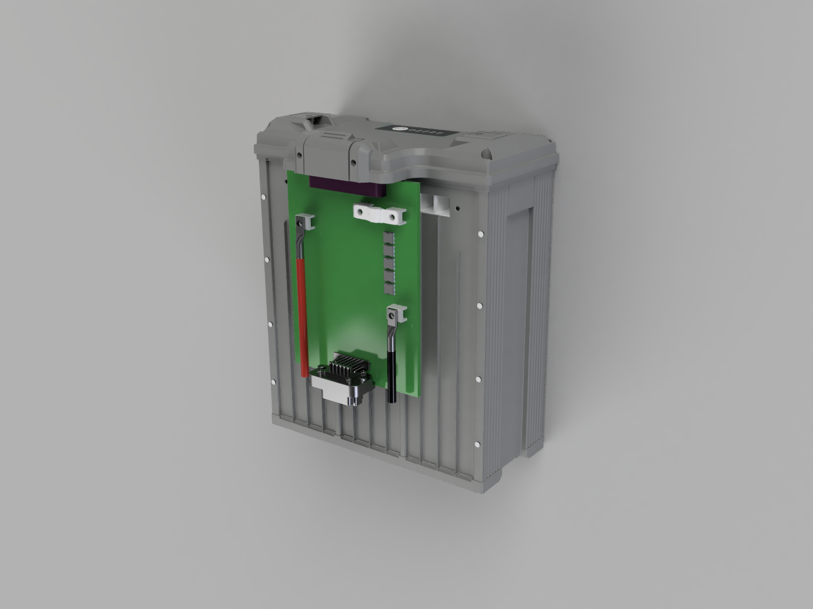
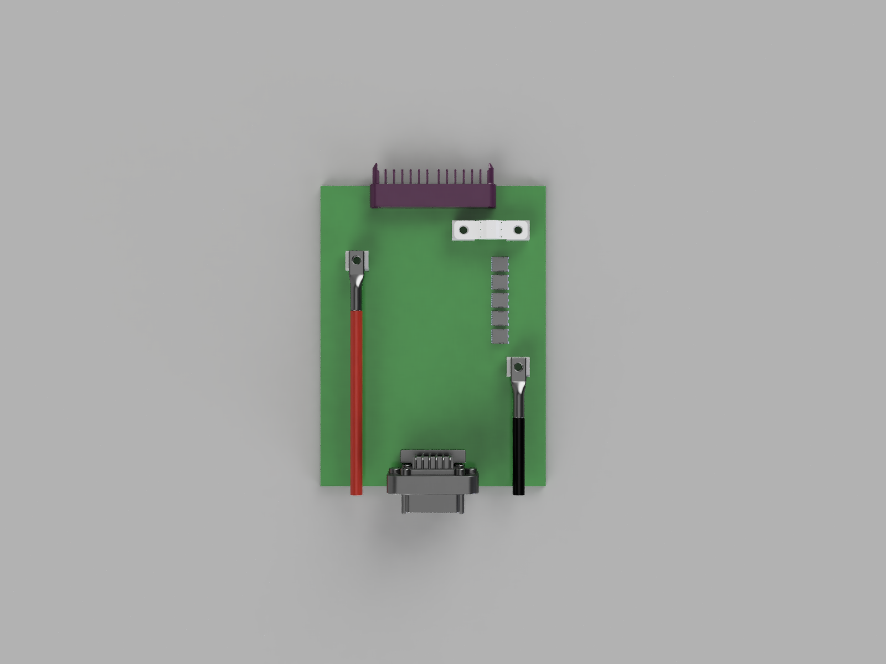

# CBC_PCB — Caribou Battery Connector PCB

The Caribou Battery Connector PCB (CBC) interfaces 18S smart battery packs with the Caribou hexacopter electrical system. Each motor arm carries one CBC board connected to one battery, providing power switching, protection, voltage regulation, and dual CAN bus communication.

- **GitHub issue:** [#6 — Design BC-PCB for Caribou: 18S, 100A nominal, 200A spike](https://github.com/Arrow-air/project-caribou/issues/6)
- **Starting point:** Project Quiver BC-PCB KiCad design.
- **EDA Tool:** KiCad 10
- **Initial layout import:** KiCad source is in [`kicad/`](kicad/); import notes are in [`docs/import-2026-05-19-cbc-layout.md`](docs/import-2026-05-19-cbc-layout.md).

## Context within Project Caribou

Project Caribou is a ~200 kg MTOW heavy-lift hexacopter with ~100 kg payload capacity, 18–24S power architecture, and ArduPilot firmware. The aircraft uses 6× Hobbywing XRotor X15 propulsion units, each fed by a dedicated 18S Tattu 4.0 smart battery.

Each of the 6 motor arms has:
- 1× Tattu 4.0 18S battery pack
- **1× CBC_PCB** (this board) — battery interface, protection, regulation
- 1× Hobbywing XRotor X15 motor + ESC

The CBC board sits between the battery and the propulsion unit. It provides:
1. **Battery interface** — receives battery power and battery CAN via the [C90D adapter PCB](../C90D_PCB/), which mates the Tattu 4.0 battery connector
2. **Short-circuit protection** — 250A ceramic fuse
3. **Active power switching** — precharge, kill switch, power enable via MOSFETs
4. **Voltage regulation** — galvanically isolated 12V (GNDE) for the aircraft power distribution, plus non-isolated 5V/3.3V (GNDI) for onboard logic
5. **Dual CAN bus** — battery protocol (CAN 1) and DroneCAN (CAN 2) as bridge
6. **Wireless diagnostics** — WiFi/BLE via ESP32-S3 for configuration and monitoring

The regulated 12V output (GNDE) feeds into the Caribou Main PCB ([CMAIN_PCB](../CMAIN_PCB/)) via the JST JWPF signal connector (J501) harness.

## Concept Renderings

These early renderings show the intended CBC_PCB packaging concept and approximate component placement. They are illustrative only and may change during schematic/layout development.





## Board Overview

```
Battery (18S Tattu 4.0)
        |
        v
+---------------------+
|  C90D Adapter PCB    |  ← Separate board: mates the battery connector,
|  (../C90D_PCB/)      |     bridges present-detect pins
+---------------------+
        |
        v
+---------------------+
|  Power Entry Pads    |  ← Power (+ / −) via HC201/HC202 pads,
|  + Battery CAN       |     CAN L/H from battery via CN201
+---------------------+
|  AMXL-250 Fuse       |  ← 250A short-circuit protection
+---------------------+
|  MOSFETs             |  ← Precharge / Kill switch / Power enable
+---------------------+
|  Screw Terminals     |  ← Red (+) and Black (−) cables
|  (AMT0650009DB0000G) |     to Hobbywing X15 propulsion
+---------------------+
|                       |
|  HV Bus (54–75.6V)   |
|    |            |     |
|    v            v     |
|  [Buck]    [Push-Pull]|
|  5V/1A     12V/10A   |
|  (GNDI)    (isolated) |
|    |        (GNDE)    |
|    v            |     |
|  [LDO]         |     |
|  3.3V          |     |
|  (GNDI)        |     |
+---------------------+
|  JST JWPF Connector  |  ← 12V (GNDE), DroneCAN, signals
|  (J501, 8-pos)       |     to aircraft harness → CMAIN_PCB
+---------------------+
```

## Specifications

| Parameter | Value |
|---|---|
| Configuration | 18S (18 series cell groups) |
| Max Voltage | 75.6V (4.2V × 18) |
| Nominal Voltage | 64.8V (3.6V × 18) |
| Continuous Current | 150A (in line with the C90D power path) |
| Spike Current | 200A (short duration) |
| Board Shape | Rectangular |
| EDA Tool | KiCad 10 |
| Board Layers | TBD |

### Current Rating Justification

Based on the Hobbywing XRotor X15 motor data:

| Throttle | Thrust | Current per Motor |
|---|---|---|
| 51% | 27,257 g | 44.7 A |
| 72% | 47,933 g | 101.6 A |
| 100% | 72,647 g | 197.1 A |

Hover throttle is ~50%. The 150A continuous rating covers normal operations with margin; the 200A spike rating handles full-throttle bursts.

## Connectors and Fuse

### Battery Interface (via C90D Adapter)

The CBC does not mate the battery directly. The Tattu 4.0 pack connector mates with the [C90D adapter PCB](../C90D_PCB/), which carries the battery connector (ACES 59626), bridges the battery-present detection pins, and adapts the connector orientation into the CBC assembly.

From the C90D, the battery reaches the CBC through:

| Interface | Reference | Function |
|---|---|---|
| Power entry pads | HC201 (`H_PWR-IN`), HC202 (`H_PWR-IN--PREFUSE`) | High-current + / − power path from the C90D |
| Battery CAN connector | CN201 (A1257WV-S-2P, 2-pin GH-compatible) | `CANH_BAT` / `CANL_BAT` to the isolated battery CAN interface |

> **Note:** the battery-present detection bridge (required for the Tattu pack to power on) lives on the C90D side — see the C90D documentation for connector and mating details.

### Propulsion Screw Terminals

**Selected: Amphenol Anytek AMT0650009DB0000G**

These are the high-current screw terminals where cables to the Hobbywing X15 propulsion system are connected (+ and −).

| Parameter | Value |
|---|---|
| Type | Screw Terminal, Power Tap |
| Screw Size | M5 |
| Pins | 6 |
| Current Rating | 180A |
| Mounting | Through-Hole DIP |
| Contact Material | Brass + Steel Nut (matte tin plated) |
| Torque | 18 lbf·in |

Two sets of AMT0650009DB0000G screw terminals are used on the board: one pair for the propulsion output (+ / −), and another pair for mounting the main fuse.

### Signal Connector (Drone Interface)

**Selected: JST B08B-JWPF-SK-R (J501)**

This connector interfaces the CBC with the rest of the Caribou electrical system via a wiring harness to the [CMAIN_PCB](../CMAIN_PCB/). The JWPF series is a waterproof wire-to-board connector family; an earlier Amphenol AT13 concept was dropped in favor of JST.

| Pin | Signal | Function |
|---|---|---|
| 1 | GNDE | Isolated ground |
| 2 | GNDE | Isolated ground |
| 3 | 12V_ISOLATED | Isolated 12V output to aircraft LV system |
| 4 | 12V_ISOLATED | Isolated 12V output to aircraft LV system |
| 5 | CANL_DRONE | DroneCAN low |
| 6 | CANH_DRONE | DroneCAN high |
| 7 | 12V_TRIGGER_SIG | Kill switch trigger signal |
| 8 | 12V_SUPPLY | 12V supply input |

The 8 positions carry the isolated 12V output (GNDE), the DroneCAN bus pair, and the kill/control signals to/from the Caribou avionics.

### Main Fuse (Short-Circuit Protection)

**Selected: Eaton AMXL-250**

The main fuse sits between the battery connector and the power output stage, protecting against short circuits. It is mounted on two AMT0650009DB0000G screw terminals (bolt-in design).

| Parameter | Value |
|---|---|
| Type | Automotive bolt-in fuse |
| Current Rating | 250A |
| Voltage Rating | 125 Vdc |
| Body | Ceramic |
| Mounting | Bolt-in (M5 terminals) on 2× AMT0650009DB0000G |

The 250A fuse rating provides short-circuit protection while allowing the full 200A spike current without nuisance blowing. The ceramic body handles the thermal demands of high-current interruption.

## MCU and Communication

### MCU: ESP32-S3-WROOM-1 (U301)

The ESP32-S3-WROOM-1 module (N16R8 variant) is a dual-core microcontroller with integrated wireless connectivity. It includes a PCB antenna — no external antenna components are required. A keepout zone must be maintained around the antenna area on the PCB layout (no copper / ground plane underneath).

| Parameter | Value |
|---|---|
| Core | 2× 32-bit Xtensa LX7, up to 240 MHz |
| Flash | 16 MB (N16R8) |
| PSRAM | 8 MB (N16R8) |
| WiFi | 802.11 b/g/n (2.4 GHz) |
| Bluetooth | BLE 5.0 |
| Operating Voltage | 3.0–3.6V |
| Antenna | Integrated PCB antenna |

### Dual CAN Bus (2× MCP2515 + Transceiver)

Two independent CAN networks using external MCP2515 controllers on a shared SPI bus. This provides identical timing behavior on both buses and clean separation of the battery-side and drone-side CAN domains.

| CAN Bus | Purpose | Controller | Transceiver |
|---|---|---|---|
| CAN 1 — Battery | Battery protocol (smart battery communication) | MCP2515 (U402, SPI, CS1) | ADM3053BRWZ (U404, galvanically isolated) |
| CAN 2 — Drone | DroneCAN (UAVCAN v0) interface to Caribou avionics | MCP2515 (U401, SPI, CS2) | TJA1049T/3J (U403) |

The battery CAN transceiver (ADM3053) has an integrated isolated DC-DC converter, so the battery-side CAN domain is galvanically isolated from the board logic. Each MCP2515 is clocked by a 16 MHz crystal (X401/X402). 120 Ω termination resistors are jumper-selectable and open by default.

The board converts between the battery protocol (CAN 1) and DroneCAN (CAN 2). The DroneCAN bus connects via the J501 signal connector through the wiring harness to the [CMAIN_PCB](../CMAIN_PCB/), which serves as the central avionics hub for all 6 motor arms.

### Schematic Sheet Interfaces

| Signal / rail | Source sheet | Destination sheet(s) | Direction / notes |
|---|---|---|---|
| `H_PWR-IN`, `H_PWR-IN-`, `H_PWR-IN--PREFUSE` | POWER SECTION | POWER SECTION / board power path | 18S battery high-current domain; main fuse is mounted on two of the AMT screw terminals (J201–J204). |
| `+5V` | POWER REGULATOR | ESP32 SECTION, CAN SECTION, PERIPHERALS | Internal non-isolated logic rail. |
| `+3V3` | POWER REGULATOR | ESP32 SECTION, CAN SECTION, PERIPHERALS | ESP32, MCP2515, CAN transceivers, sensors. |
| `12V_ISOLATED` | POWER REGULATOR | PERIPHERALS / J501 connector | Isolated output to aircraft harness; add an output fuse before harness output. |
| `ESP_ENABLE_SIGNAL` | ESP32 SECTION | POWER SECTION | ESP-controlled main MOSFET latch enable (latch: `U201` 74LVC2G02); latch output default-low via `R207` pulldown. |
| `PRECHARGE_ESP_SIGNAL` | ESP32 SECTION | POWER SECTION | ESP-controlled precharge command. |
| `SCHMITT_OUT` | POWER SECTION | ESP32 SECTION | Hardware kill/trigger state feedback to ESP32. |
| `SCK`, `MOSI`, `MISO` | ESP32 SECTION / CAN SECTION | ESP32 ↔ dual MCP2515 | Shared SPI bus; `SCK`/`MOSI` from ESP32, `MISO` from MCP2515s. |
| `CS#1`, `CS#2` | ESP32 SECTION | CAN SECTION | MCP2515 chip-selects; add pull-ups so controllers remain deselected during ESP32 reset/boot. |
| `INT#1`, `INT#2` | CAN SECTION | ESP32 SECTION | MCP2515 interrupt outputs; ESP32 pull-up usage is documented in firmware/hardware notes. |
| `RESET1`, `RESET2` | ESP32 SECTION | CAN SECTION | MCP2515 resets from ESP32. |
| `TEMP1_DQ`, `TEMP2_DQ` | ESP32 SECTION / PERIPHERALS | ESP32 ↔ temperature sensors | 1-Wire data nets; formerly `DATA1` / `DATA2`. |
| `CANH_BAT`, `CANL_BAT` | CAN SECTION / POWER SECTION | Battery connector ↔ CAN 1 | Battery CAN pair only; no battery CAN ground is normally carried. |
| `CANH_DRONE`, `CANL_DRONE` | CAN SECTION / PERIPHERALS | CAN 2 ↔ J501 harness | DroneCAN pair to CMAIN_PCB; termination is jumper-selectable and normally open. |
| `GND_CA`, `GND_CB`, `GNDI`, `GNDE` | Multiple | Domain-specific returns | `GND_CA` is effectively unused unless battery CAN reference is later required. `GND_CB` may be tied with other CBC `GND_CB` references on CMAIN_PCB. |

### GPIO Allocation

As routed on the ordered board (from the production netlist):

| Function | Signal | ESP32-S3 GPIO |
|---|---|---|
| Precharge command | `PRECHARGE_ESP_SIGNAL` | IO4 |
| Kill/trigger state feedback | `SCHMITT_OUT` | IO5 |
| Main MOSFET latch enable | `ESP_ENABLE_SIGNAL` | IO6 |
| Temperature sensors (1-Wire, DS18B20) | `TEMP2_DQ` / `TEMP1_DQ` | IO7 / IO15 |
| Shared SPI — MOSI, SCK, MISO | `MOSI` / `SCK` / `MISO` | IO11 / IO12 / IO13 |
| MCP2515 #1 (Battery CAN) — CS, INT, RESET | `CS#1` / `INT#1` / `RESET1` | IO10 / IO21 / IO48 |
| MCP2515 #2 (Drone CAN) — CS, INT, RESET | `CS#2` / `INT#2` / `RESET2` | IO14 / IO47 / IO9 |

## Functional Requirements

### Power Path

- **High-side MOSFET switching** — N-channel MOSFETs with charge pump gate drive
- **Precharge circuit** — soft-start via resistor + relay/MOSFET to limit inrush current
- **Emergency kill switch** — hardware-level kill input, independent of MCU. Connects to the Caribou external HV kill switch via the AT signal connector.
- **Main fuse** — Eaton AMXL-250 (250A) bolt-in fuse for short-circuit protection

### Voltage Regulation

The power supply architecture uses two independent stages with full galvanic isolation between internal onboard logic (GNDI) and external drone systems (GNDE).

#### Internal Supply (GNDI — non-isolated)

Provides power for onboard logic (ESP32, MCP2515, CAN transceivers, gate drivers, sensors).

| Stage | Topology | IC | Input | Output | Notes |
|---|---|---|---|---|---|
| 5V Rail | Sync Buck | e.g. MP9487 or similar (100V+, integrated FETs, ≥1A) | 54–75.6V (HV Bus) | 5V / 1A | Main internal rail |
| 3.3V Rail | LDO | e.g. AMS1117-3.3 or similar | 5V | 3.3V | ESP32, MCP2515, CAN transceivers |

#### External Supply (GNDE — galvanically isolated)

Provides isolated 12V output for the Caribou aircraft power distribution via the [CMAIN_PCB](../CMAIN_PCB/).

| Stage | Topology | IC | Input | Output | Notes |
|---|---|---|---|---|---|
| 12V Rail | Isolated Push-Pull | TBD | 54–75.6V (HV Bus) | 12V / 10A (isolated, GNDE) | Powers aircraft avionics, sensors, servos via CMAIN_PCB |

The isolation barrier between GNDI and GNDE ensures that a fault on the aircraft power bus does not back-feed into the battery management logic.

## Folder Layout

```
CBC_PCB/
├── README.md               ← this file
├── docs/                   ← board-specific notes, requirements, design docs
│   ├── connector-pinout.md ← connector/harness pinout and wiring notes
│   ├── power-architecture.md ← power tree and protection notes
│   └── schematic-review-followup.md ← schematic review action register
├── firmware/               ← board-specific firmware (ESP32-S3)
├── images/                 ← board renders, screenshots, diagrams, photos
├── kicad/                  ← KiCad 10 project files
│   └── libs/               ← project-local KiCad libraries
│       ├── 3dmodels/       ← project-local 3D models
│       ├── CBC_PCB.pretty/ ← project-local footprint library
│       └── CBC_PCB.kicad_sym ← project-local symbol library
└── manufacturing/          ← Gerbers, BOM, assembly drawings, pick-and-place
```

## Related

- [CMAIN_PCB](../CMAIN_PCB/) — Caribou Main PCB (central avionics hub)
- [Project Caribou](https://github.com/Arrow-air/project-caribou) — parent project
- [Issue #6](https://github.com/Arrow-air/project-caribou/issues/6) — tracking issue for this board
- [Issue #8](https://github.com/Arrow-air/project-caribou/issues/8) — CMAIN_PCB tracking issue
